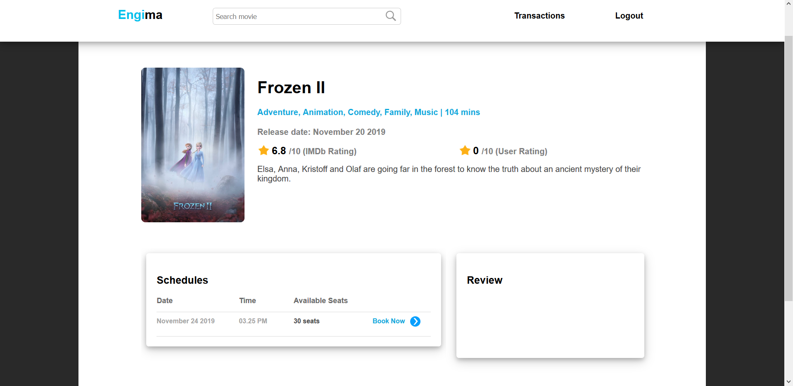
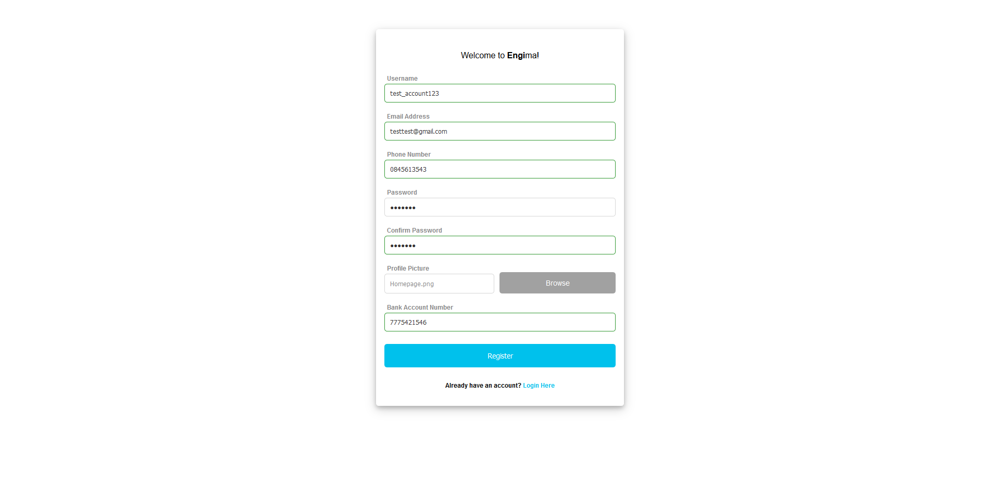
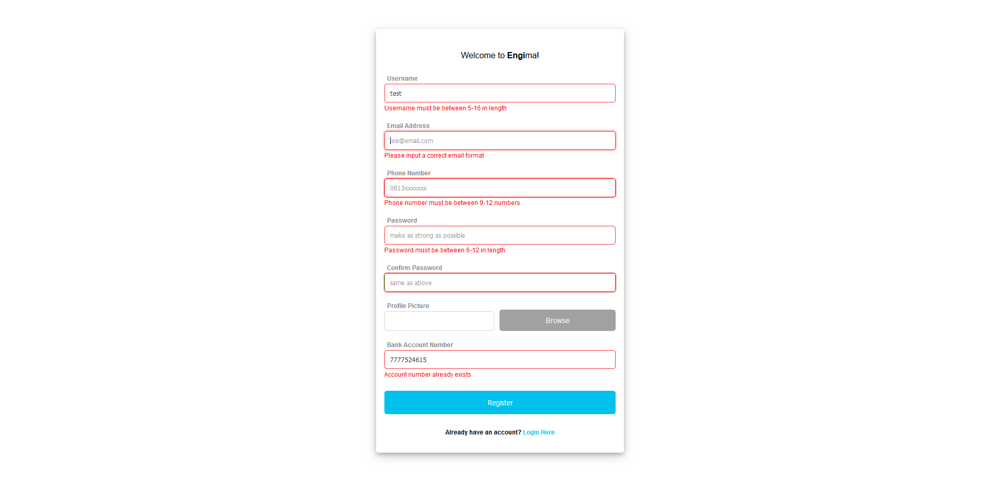
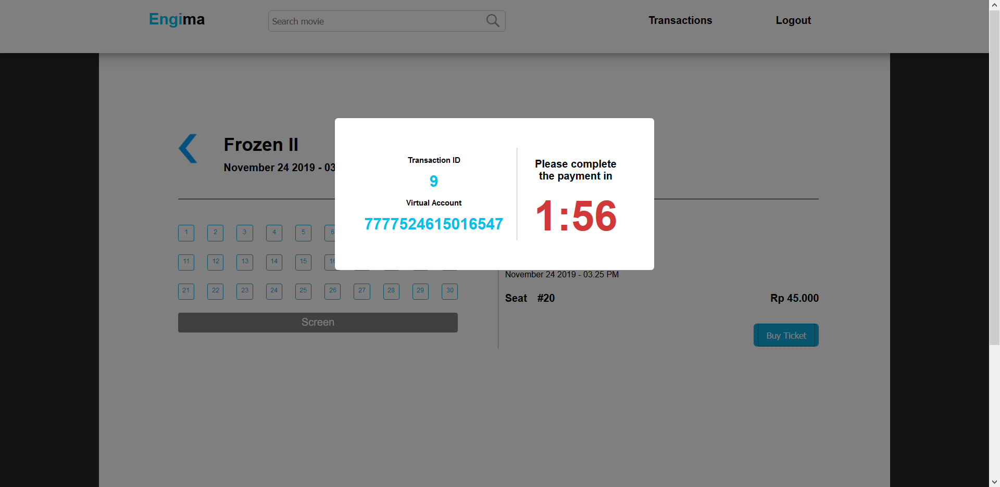

<h1 align="center">
    <b>
         
        # Tugas Besar 2 IF3110 Pengembangan Aplikasi Berbasis Web
         
    </b>
</h1>

<h2 align="center">
    <b>
         
        Engima
         
         
    </b>
</h2>

## Deskripsi Singkat

Setelah aplikasi web Engima diluncurkan, bioskop Engi menjadi sangat laku. Sebelumnya, Engi
mengurus semua transaksi tiket film dan penambahan data film secara manual. Karena
kewalahan, akhirnya Engi pergi ke seorang konsultan IT untuk menemukan solusi dari
permasalahannya. Konsultan menyarankan Engi untuk menggunakan web service untuk
mempermudah pekerjaannya. Melihat aplikasi web yang Anda kerjakan memuaskan, Engi
meminta Anda untuk mengimplementasikan perubahan tersebut beserta web service dan
aplikasi Bank yang digunakan untuk transaksi tiket film di Engima.

## Link Website

Halaman Engima: 54.163.161.180/engima
 
 
Halaman Bank Pro: 54.163.161.180:5000
 

## Screenshots

## Register

 
 

 
 

## Film Detail

 
 

## Buy Ticket

 
 

## Transaction History
 

## Keterangan Tambahan

* Jam pada aplikasi web mengacu pada jam lokal pengguna.
* Basis data menggunakan MySQL.

## Pembagian Tugas

### REST
1. Create transaksi - 13517089
2. Update transasksi - 13517059
3. Mendapatkan seluruh transaksi id pengguna - 13517134
4. Database transaksi - 13517089

### SOAP
1. Database bank - 13517059
2. Validasi - 13517134
3. Mendapatkan data nasabah - 13517134
4. Melakukan transaksi - 13517059
5. Membuat virtual account - 13517089
6. Mengecek transaksi - 13517089

### React
1. Halaman login - 13517134
2. Halaman utama - 13517059
3. Halaman transfer - 13517059
4. Halaman history - 13517089

### Perubahan Engima
1. Perubahan database - 13517089
2. Pengambilan movie dari API - 13517089
3. Perubahan halaman film detail - 13517134
4. Perubahan halaman home - 13517059
5. Perubahan halaman buy ticket - 13517059
6. Perubahan halaman transaction history - 13517089

    <b>
         
        
            About
        
    </b>

    <b>
        IF3110-Pengembangan Aplikasi Berbasis Web - 2019
         
        Teknik Informatika 2017
         
         
        13517059 - Nixon Andhika
         
        13517089 - Bram Musuko Panjaitan
         
        13517134 - Renita Napitupulu
    </b>

